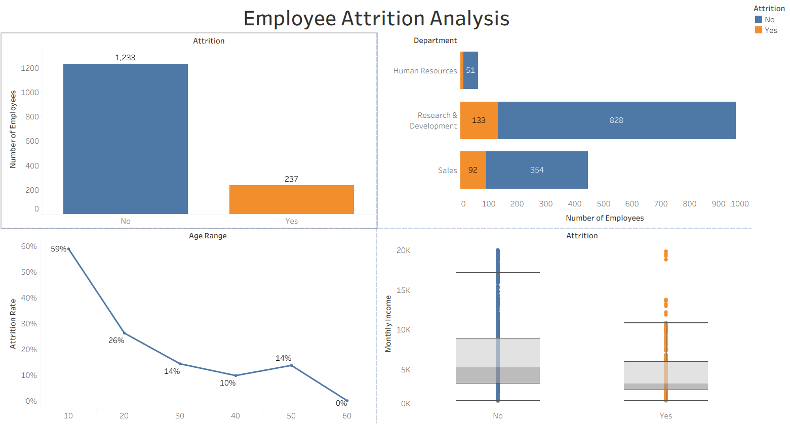

# Employee Attrition Analysis Dashboard

An interactive Tableau dashboard analyzing employee attrition patterns using the IBM HR Analytics dataset. This project explores why employees leave a company by examining department, age, and income trends.

## 📊 Dashboard Preview

## 🎯 Objective

To identify key factors contributing to employee attrition and provide actionable insights for HR decision-making, using data visualization and exploratory analysis.

## 🔍 Key Insights

- Overall attrition rate is significantly lower among long-tenured employees than newer employees
- Research & Development and Sales departments show the highest attrition counts
- Attrition rate is notably higher in younger age groups compared to older employees
- Employees who leave tend to have lower median monthly income than those who stay

## 📈 Charts Included

1. **Attrition Overview** — Total count of employees who stayed vs. left
2. **Attrition by Department** — Breakdown of attrition across departments
3. **Attrition by Age Group** — Attrition rate trend across age ranges
4. **Income vs Attrition** — Box plot comparing monthly income distribution for employees who stayed vs. left

## 🛠️ Tools Used

- **Tableau Public** — Dashboard design and data visualization
- **Dataset:** IBM HR Analytics Employee Attrition Dataset (Kaggle)

## 📁 Files in this Repository

- `WA_Fn-UseC_-HR-Employee-Attrition.csv` — Raw dataset
- `Employee Attrition Analysis.twbx` — Tableau packaged workbook
- `Dashboard_screenshot.png.png` — Dashboard preview image

## 🔗 Live Dashboard

https://drive.google.com/file/d/1qylHl-9_wPgRIKn2uHUN7t5j1YSluefM/view?usp=sharing

## 👤 Author

**Shiv**
GitHub: [Shivoff](https://github.com/Shivoff)
